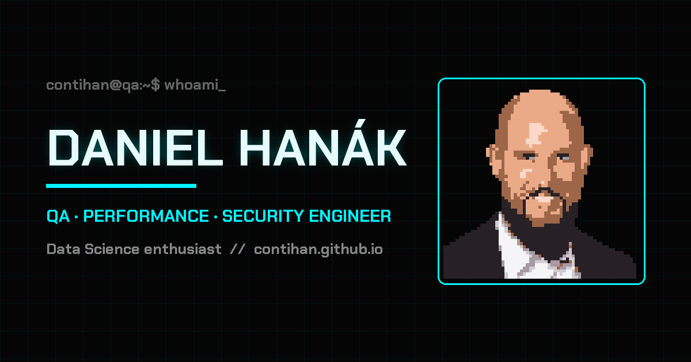

# contihan.github.io

[](https://github.com/ContiHan/contihan.github.io/actions/workflows/ci.yml)

Personal portfolio of **Daniel Hanák** (ContiHan) — QA, Performance & Security Engineer.
Cyberpunk-styled, hand-written in **vanilla HTML/CSS/JS** with zero frameworks and zero runtime dependencies.



**Live:** [contihan.github.io](https://contihan.github.io)

## Highlights

- **Zero third-party requests** — fonts self-hosted (woff2, latin subset), icons served as a 10 KB inline SVG sprite, no CDN, no trackers. GDPR-clean by design.
- **Content-Security-Policy** with `script-src 'self'` — no inline scripts anywhere.
- **Performance budget enforced in CI** — Lighthouse ≥ 90 in all categories, total page weight under 1 MB (currently ~700 KB including all images).
- **Accessible** — keyboard-operable controls, `prefers-reduced-motion` support, WCAG AA contrast in both themes, axe-audited in CI.
- **Dark / light theme** with pre-paint initialization (no flash), theme-aware custom SVG cursors.
- **Interactive terminal** with commands and hidden protocols; window chrome adapts to the visitor's OS (macOS / Windows / Linux).

## Easter eggs

Findable via the terminal's `secret` command:

- type `hack` anywhere (or run it in the terminal) — Matrix protocol, `Esc` to abort
- Konami code `↑↑↓↓←→←→BA` (swipe `↑↑↓↓←→←→` on mobile)
- tap the avatar 5× rapidly

## Development

Static site — any web server works:

```bash
npx http-server -p 4173 -c-1
```

or use the VS Code *Live Server* extension.

## Quality gates (CI)

Every push runs lint → smoke tests → Lighthouse budget via GitHub Actions:

```bash
npm ci
npm run lint     # HTMLHint + Stylelint + ESLint
npm test         # Playwright: layout, terminal, XSS regressions, easter eggs, axe a11y scan
npm run lhci     # Lighthouse CI with performance budget
```

## Credits

- Icons: [Font Awesome Free](https://fontawesome.com) 6.4.0 ([CC BY 4.0](https://creativecommons.org/licenses/by/4.0/)), bundled as an SVG sprite
- Fonts: [Fira Code](https://github.com/tonsky/FiraCode) & [Chakra Petch](https://fonts.google.com/specimen/Chakra+Petch) ([SIL OFL](https://openfontlicense.org/)), self-hosted
